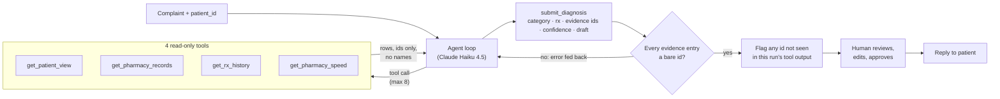

# RxSync Investigator

An LLM agent that investigates pharmacy-app complaints against the pharmacy's own
records, cites what it found, and drafts a reply for a human to approve.

## The problem

Public App Store reviews of pharmacy apps such as
[NimbleRx](https://apps.apple.com/app/id1047798731) suggest a recurring pattern:
the app says a prescription is ready when it isn't, lists one twice, or misses an
automatic refill. My hypothesis, drawn only from those public reviews, is that
many of these complaints come from sync faults between the pharmacy systems and
the app. A support agent could diagnose them by comparing the two, rather than
by reading the complaint alone. This project tests that hypothesis on **synthetic
data only**: every patient, prescription and pharmacy here is generated, and no
real or scraped data enters the repository.

## Headline result

Both runs below use the same 48 tickets (eval v2.1), with neutral wording that gives no hint of the category:

| Run | Category accuracy | Rx accuracy | Cost per ticket |
| --- | --- | --- | --- |
| **Haiku 4.5 + tools** | **95.8%** (46/48) | **100%** (40/40) | **~$0.0125** |
| Haiku 4.5, text only (baseline) | 16.7% (8/48) | 0% (0/40) | ~$0.003 |

Rx accuracy is scored on the 40 fault tickets. The other 8 have no prescription to name.

The baseline answers `no_issue_found` on every ticket. That is the right thing to
do when all it has is neutral text, and it shows that the tools, not the wording,
carry the signal. Both misses by the tool-using agent are "needs renewal" cases
(see [Known limitations](#known-limitations)). Full report:
[`evals/report.md`](evals/report.md).

## How it works



- **Four tools** (`investigator/tools.py`), all read-only and identified by id. None of them ever returns a patient name.
  | Tool | Answers |
  | --- | --- |
  | `get_patient_view` | What did the app show? (faults included) |
  | `get_pharmacy_records` | What do the pharmacy's records say? |
  | `get_rx_history` | What happened to this prescription, and when? This tool computes the refill due date and days overdue itself. |
  | `get_pharmacy_speed` | Is this wait normal for this pharmacy? |
- **The agent loop** (`investigator/agent.py`) allows at most 8 investigative calls. Once they are used up, `submit_diagnosis` is the only tool offered, so every run ends in a decision.
- **`submit_diagnosis`** takes one of `duplicate`, `dropped`, `stale_status`, `phantom_schedule` or `no_issue_found`, plus an rx number, evidence ids, a confidence score and a draft reply.
- **The evidence check** has two parts. An entry that isn't a bare id (`RX…` or `A/B/C#####`) is rejected, and the error goes back to the model so it can resubmit. An id that never appeared in that run's tool output is flagged as unverified and counted against evidence validity, which was 100% in v2.1.
- **The enforced tool list:** the tools offered on each turn are the permission boundary. If the model calls a tool it wasn't offered on that turn, the call is refused rather than executed.
- **A human approves every reply.** The agent only drafts. In the web app, a person reads the reply, can edit it, and clicks *Approve & copy*. Nothing is sent automatically.

## The eval story

The simulator plants four kinds of fault and writes each one to an answer key
(`data/faults.jsonl`). The agent is graded against that key rather than judged by
eye.

| Version | Change | Haiku + tools | Baseline | What it taught |
| --- | --- | --- | --- | --- |
| v1 | Wording differed per category | 97.9% | **100%** | The complaint wording leaked the label, so a model with no data access scored perfectly and the eval measured nothing. |
| v2 | One neutral wording for every category | 89.6% | 16.7% | The measurement became real, and every miss was a `phantom_schedule`: no tool gave the date, so the agent guessed what "today" was. |
| v2.1 | Tools compute `as_of`, the refill due date and days overdue | **95.8%** | 16.7% | Put the arithmetic in code rather than asking the model to do it. Phantom recall went from 7/10 to 10/10 for about $0.0006 more per ticket. |

## Known limitations

- **The `needs_renewal` gap (T042, T043).** Both remaining misses are prescriptions with no auto-refill and no refills left, past their supply (by 12 and 44 days). The agent called them `phantom_schedule`, but the answer key says `no_issue_found`. What these patients really need is a renewal, and the category set has no label for that.
- **Run-to-run variance.** The agent samples at the default temperature, so ambiguous tickets can flip between runs. T043 came out right in 2 of 5 repeat runs with the earlier prompt and in 1 of 5 with the current one. An earlier v2.1 run scored 97.9% only because T043 happened to land on the right answer.
- **One problem per ticket.** Each ticket is built around one planted fault, and `submit_diagnosis` returns one category. A patient with two problems gets one answer.
- **The demo key is not authentication.** The API checks a shared `x-demo-key` header. That key ships in the browser bundle, and there are no user accounts and no rate limits.
- **Synthetic data only.** The fault types and rates are my own assumptions, not measurements from a real pharmacy. The results show the method works on this data, not how often these faults occur in practice.

## How to run

Requires [uv](https://docs.astral.sh/uv/) and, for the web app, Node 18+. No database, no Docker.

```bash
uv sync                                                    # Python 3.12 + deps
uv run python -m simulator.generate --seed 42 --out data   # build data/ (~1 s)
```

**Tests**

```bash
uv run pytest          # fast suite; slow full-scale checks deselected
uv run pytest -m ""    # everything: 308 tests
uv run ruff check . && uv run ruff format --check .
```

**Eval.** This needs `ANTHROPIC_API_KEY` in `.env` (copy it from `.env.example`). It makes real, paid API calls.

```bash
# Rebuild evals/tickets.jsonl (two steps: build the set, then apply the neutral v2 wording)
uv run python -m evals.make_tickets --out /tmp/labelled.jsonl
uv run python -m evals.make_tickets --style neutral --from /tmp/labelled.jsonl
uv run python -m evals.run_eval --runs haiku+tools         # ~$0.60 for 48 tickets
uv run python -m evals.run_eval                            # all three runs, including Sonnet; --budget caps spend (default $3)
```

**Web app** (two terminals):

```bash
# terminal 1: API on :8000 (reads ANTHROPIC_API_KEY from .env)
DEMO_KEY=local-dev-key uv run uvicorn api.local:app --reload --port 8000

# terminal 2: UI on :5173
cd web
cp .env.local.example .env.local    # VITE_DEMO_KEY must match DEMO_KEY above
npm install
npm run dev
```

If port 5173 is taken, run `npm run dev -- --port 5174` and start the API with
`ALLOWED_ORIGIN=http://localhost:5174` so that CORS allows it.

## Status

### Built

- A deterministic simulator: 50 pharmacies, 2,000 patients, 5,000 prescriptions, three disagreeing pharmacy export formats, 350 planted faults and an answer key.
- Four read-only tools with tests for privacy (no names returned) and error handling.
- The agent loop, with a tool-call budget, an enforced tool list and evidence checking.
- A 48-ticket eval set, a grader, and reports for v1, v2 and v2.1.
- An HTTP API (`api/handler.py`) with one router behind two adapters: FastAPI for local use and an AWS Lambda function-URL handler.
- A React UI: pick a patient, investigate, see the verdict, cited evidence and full tool trace, edit and approve the draft, and browse the eval results.

### Designed, not built

- **Deployment on AWS Lambda with Terraform.** The Lambda handler exists and is tested, but `infra/` is still empty and nothing is deployed.
- **CI** running the full test suite and lint on every push. No workflow exists yet.

### Next

- A `needs_renewal` category, so cases like T042 and T043 have a correct answer.
- Tickets with more than one problem, and diagnoses that can return several findings.
- A Slack integration, so drafts reach support staff where they already work.
- Real login and rate limits to replace the demo key.

## Layout

| Path | Holds |
| --- | --- |
| `simulator/` | The synthetic world, the three exports, the app view and the answer key |
| `investigator/` | `tools.py` (the 4 tools) and `agent.py` (the loop) |
| `evals/` | Ticket builder, grader, and every version's tickets, results and reports |
| `api/` | The shared router, the Lambda handler and the local FastAPI adapter |
| `web/` | The React + Vite UI |
| `specs/` | Feature specs |
| `docs/agent-log.md` | A running record of what went wrong and why |
